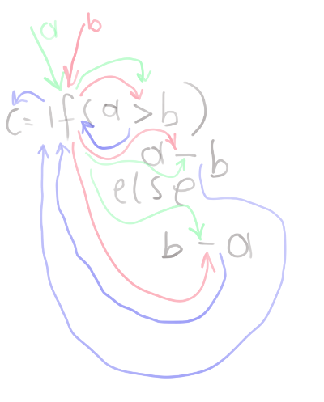

# picoservice
An execution model for some functional language constructs based on asynchronous buffered message passing (along the lines of the [actor](https://en.wikipedia.org/wiki/Actor_model) model).

- A single inherently parallel model of computation for local and distributed algorithms
- Persistent, recoverable execution state using event logging 
- to be embedded in a host language, avoiding new language constructs

## ingredients

Constants, immutable values and let-statements.

Functions. They may be
- recursive (optionally tail call optimized)
- partially applied
- of higher order, accepting functions as arguments
- a conditional

-  primitive, this might be on the level of `+`, `-`, `>` or `<=`, but it could be as well a call of a connector to an external data provider, expensive both in terms of time and of money charged.

## concurrent message passing

A function receives named values as messages and propagates them to subsequent functions as needed. Each function is an actor, so all off them operate concurrently. 

Message passing happens asap, you could have function A calling function B and B already computing a result while A hasn't received all its parameters yet (but enough for B).
On the other hand usual conditionals, tail call optimized recusive functions and functions with functional parameters may need to stash parameters until the computation can proceed (until the functional value has been provided and can be applied, the condition has been computed and the chosen branch can execute, the next recursive call can execute).  

Further, if it is a primitive and got all values to compute a result it does so and propagates the result to the designated recipient. 
Any non primitive function that receives a result value propagates it to its own designated recipient of a result.

A [conditional is a function](https://stackoverflow.com/questions/58316588/how-to-model-if-expressions-with-actor-systems) with signature: `if(condition, value_true_branch, value_false_branch)` and comes in two flavors. One is the usual semantics where either the true or false branch get evaluated on
the condition. The second flavour calculates all 3 elements concurrently and returns the result of one branch as soon as the condition and all necessary parameters are available.

Let's say a function `C` that takes 2 values (`a`, `b`) and subtracts the smaller one from the bigger one. It consists of 3 primitive functions (`>` and 2 times `-`, say `-t`, `-f`) and one `if`.



That's a possible sequence of events, le's say `X`->`a`->`Y` means `X` sends `a` to `Y` and let's assume a caller `Γ`.

```
1  Γ -> a -> C
2  C -> a -> if 
3  Γ -> b -> C
4  C -> b -> if
5  if -> a -> >
6  if -> b -> >
7  > -> condition -> if
8  if -> a -> -t
9  if -> a -> -f
10 if -> b -> -t
11 if -> b -> -f
12 -t -> value_true_branch -> if
13 -t -> value_false_branch -> if  
14 if -> result -> C
15 C -> result -> Γ 
```
Note, that it could as well happen that way.

```
1  Γ -> b -> C
2  Γ -> a -> C
3  C -> a -> if 
4  if -> a -> >
5  if -> a -> -t
6  if -> a -> -f
7  C -> b -> if
8  if -> b -> >
9  if -> b -> -t
10 > -> condition -> if
11 -t -> value_true_branch -> if
12 if -> b -> -f
13 if -> result -> C
14 C -> result -> Γ 
15 -t -> value_false_branch -> if  
```
## event logging/recovery

A log of events causing state change is used to restore the computation state and resume the compuation from the last operations logged.

## tail call optimization

With the limitation that logging and recovery of the function body happens at the granularity of the whole function call. 
That means, a partially computed function body can't be recovered, as it is possible otherwise. That should be possible here too actually.


## TODO

- location transparency for function calls
- mutability maybe
- value de-duplication in event logs
- add scatter/gather semantics at least
- a compiler, from any language with functional primitives
- integration to a source language, there shouldn't be a 2nd form needed to get a picoservice-executed function   
- a field of application, perhaps long running processes with big chunks as primitives like in a workflow system, just that you write your workflows in plan Java or whatever

## algorithms

...expressed in the elements of the execution model (its byte code, kind of)

A [functional version of quicksort](https://github.com/curiosag/picoservice/blob/4eb5f317681b6287787a6a715609b5ea3bdd2c3f/src/test/java/micro/Algorithm.java#L18) 
together with a higher order [filter-function](https://github.com/curiosag/picoservice/blob/4eb5f317681b6287787a6a715609b5ea3bdd2c3f/src/test/java/micro/Algorithm.java#L98). Multiple quicksorts could be executed in parallel. The execution can be recovered and resumed from every point of its event log.


    quicksort :: (Ord a) => [a] -> [a]  
    quicksort [] = []  
    quicksort (x:xs) =   
        let smallerSorted = quicksort [a | a <- xs, a <= x]  
            biggerSorted = quicksort [a | a <- xs, a > x]  
        in  smallerSorted ++ [x] ++ biggerSorted  

Recursive calculation of [simple geometrical series](https://github.com/curiosag/picoservice/blob/4eb5f317681b6287787a6a715609b5ea3bdd2c3f/src/test/java/micro/Algorithm.java#L162) with another [tail recursive version](https://github.com/curiosag/picoservice/blob/4eb5f317681b6287787a6a715609b5ea3bdd2c3f/src/test/java/micro/Algorithm.java#L208) thereof.

    geo(n) = 1 + 2 + ... + n-1 + n


## somewhat related

- [propagation systems](https://www.cs.tufts.edu/~nr/cs257/archive/alexey-radul/phd-thesis.pdf)
- [salsa actor language](http://wcl.cs.rpi.edu/salsa/)